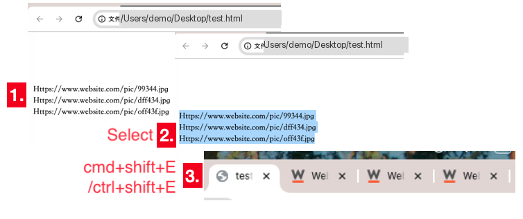
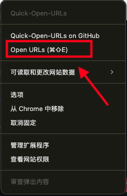
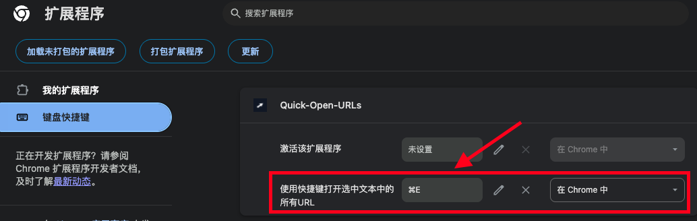
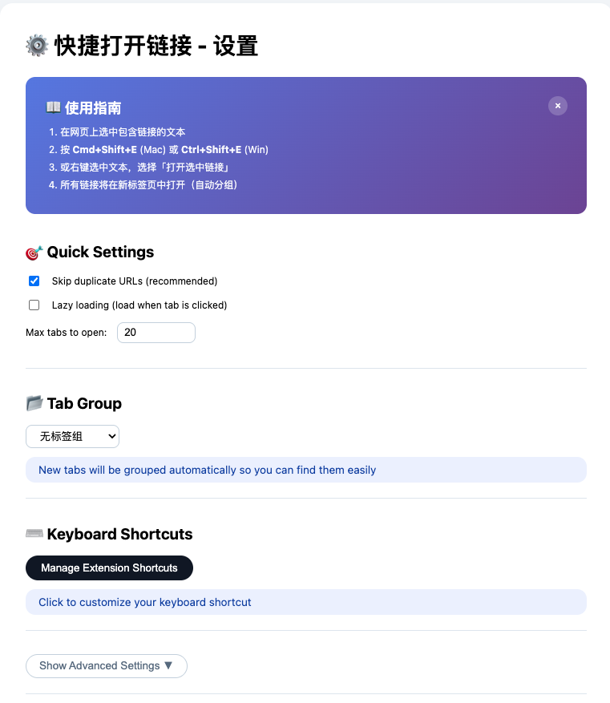

# Quick-Open-URLs

[](https://developer.chrome.com/docs/extensions/develop/migrate)
[](./quick-open-urls/manifest.json)
[](./LICENSE)

> 选中一段文字，按一个快捷键，把里面所有的链接一次性打开。
>
> 适用于从文档、表格、聊天记录里批量打开几十上百个 URL 的场景。

**English version → [README_EN.md](./README_EN.md)**

---

## 目录

- [一、它解决什么问题](#一它解决什么问题)
- [二、安装](#二安装)
- [三、使用方法](#三使用方法)
- [四、设置项说明](#四设置项说明)
- [五、URL 识别规则](#五url-识别规则)
- [六、目录结构](#六目录结构)
- [七、浏览器兼容性与已知限制](#七浏览器兼容性与已知限制)
- [八、常见问题](#八常见问题)
- [九、许可证](#九许可证)

---

## 一、它解决什么问题

日常工作中常遇到：一份文档里列了 50 个商品链接，需要逐个打开核对。手动一个个点，或者复制粘贴到地址栏，都很慢。

本扩展把这件事压缩成两步：**选中文本 → 按快捷键**。所有链接以后台标签页方式打开，不打断当前页面。

设计上刻意保持克制——不做书签管理、不做链接收藏、不上传任何数据。它只做一件事：把选中的文字变成已打开的标签页。

---

## 二、安装

### 从源码加载（开发者模式）

1. 下载或克隆本仓库
2. 打开 `chrome://extensions`（Edge 为 `edge://extensions`）
3. 打开右上角**开发者模式**
4. 点击**加载已解压的扩展程序**
5. **选择 `quick-open-urls` 子文件夹**（`manifest.json` 在这一层，不要选仓库根目录）

### 从应用商店安装

目前未上架 Chrome 应用商店，需按上述方式手动加载。

---

## 三、使用方法

### 方式一：快捷键（主要用法）

1. 在任意网页上，用鼠标选中包含 URL 的文本
2. 按 <kbd>Ctrl</kbd> + <kbd>Shift</kbd> + <kbd>E</kbd>（macOS 为 <kbd>Command</kbd> + <kbd>Shift</kbd> + <kbd>E</kbd>）
3. 所有识别到的 URL 会在后台标签页中打开



> 标签页以 `active: false` 方式创建，不会抢走当前页面焦点。这样打开 100 个链接时，浏览器不会来回跳动。

### 方式二：右键菜单

在扩展图标上点击右键，菜单里提供两项：

| 菜单项 | 作用 |
|--------|------|
| Open Selected URLs | 等同快捷键 |
| Quick-Open-URLs on GitHub | 打开本仓库 |

---

## 四、设置项说明

右键扩展图标 →「选项」，或点击**选项**进入设置页（在新标签页打开）。



| 设置项 | 默认值 | 说明 |
|--------|--------|------|
| 懒加载 | 关闭 | 不立即请求目标页面，先打开一个占位页，等标签页获得焦点时才真正加载。一次打开上百个链接时，可避免瞬间打满带宽和目标服务器 |
| 随机顺序 | 关闭 | 打乱打开顺序 |
| 倒序 | 关闭 | 按选中顺序的反向打开 |
| 去重 | **开启** | 自动去掉重复 URL，同一行只打开一次 |
| 作为搜索词 | 关闭 | 把不带协议头的文本当作搜索关键词，而非拼接成 URL。⚠️ 依赖 `chrome.search` API，**仅 Firefox 可用** |
| 标签组 | 无 | 可设为「新建标签组」或归入已有分组，便于批量关闭 |
| 容器 | 无 | 指定 Firefox 容器（Cookie 隔离）。⚠️ 依赖 `chrome.contextualIdentities` API，**仅 Firefox 可用** |




---

## 五、URL 识别规则

程序按选中文本是否含换行，走两条不同的解析路径：

| 输入形态 | 处理方式 |
|----------|----------|
| **含换行** | 每行视为一个 URL（先按 `\r\n` / `\n` 切分，再逐行 `trim`、去空行、可选去重） |
| **不含换行** | 用正则从整段文本中提取所有 URL 片段 |

补充规则：

- **自动补协议**：某一行没有 `http://` 之类的协议头时，自动补 `http://` 后打开
- **去重默认开启**：多行里出现同一链接只打开一次，可在设置里关闭
- 顺序变换的执行次序为：去重 → 倒序 → 随机

### 懒加载的例外协议

以下协议不支持懒加载，会直接打开（占位页无法代理这些地址）：

```
file  view-source  moz-extension  chrome  chrome-extension  edge  extension
```

---

## 六、目录结构

```
.
├── README.md
├── README_EN.md
└── quick-open-urls/            ← 加载扩展时选这一层
    ├── manifest.json           Manifest V3 配置、快捷键、权限声明
    ├── background.js           Service Worker：URL 解析、标签页与分组创建、右键菜单
    ├── options.html / .js      选项页与设置读写
    ├── lazyloading.html        懒加载占位页（聚焦时才跳转真实地址）
    ├── _locales/
    │   ├── zh_CN/messages.json 中文语言包
    │   ├── en/messages.json    英文语言包
    │   └── localization.js
    ├── icons/                  16 / 48 / 128 图标
    └── img/                    本文档使用的截图
```

界面语言随浏览器语言自动切换（识别 `zh` 前缀），无需手动设置。

---

## 七、浏览器兼容性与已知限制

这部分如实说明，避免被误判为 bug。

| 功能 | Chrome / Edge | Firefox | 说明 |
|------|---------------|---------|------|
| 快捷键打开 | ✅ | ✅ | |
| 右键菜单 | ✅ | ✅ | |
| 懒加载 | ✅ | ✅ | |
| 去重 / 倒序 / 随机 | ✅ | ✅ | |
| 标签组 | ✅ | ❌ | `chrome.tabs.group` / `chrome.tabGroups` 为 Chromium 专有 |
| 容器 | ❌ | ✅ | `chrome.contextualIdentities` 为 Firefox 专有 |
| 作为搜索词 | ❌ | ✅ | `chrome.search` 为 Firefox 专有 |

**为什么 Chrome 上「容器」「搜索词」点了没反应？**

这两个功能调用的 API 在 Chrome / Edge 上不存在。代码里已用 `try / catch` 包住，调用失败时静默回退为「不使用容器」「按普通 URL 处理」，不会报错、也不会中断其它链接的打开。这是预期行为，不是缺陷。

**权限说明**

扩展声明了 `<all_urls>` 主机权限与 `scripting` 权限，用途只有一个：向当前活动标签页注入脚本读取选中文本（`window.getSelection()`）。扩展不发送任何网络请求，不收集、不上传数据。

---

## 八、常见问题

**Q：按了快捷键没反应？**

先确认是否真的选中了文本——没有选中内容时，扩展会直接在控制台输出提示并静默返回，不弹窗打扰。另外请确认快捷键没有被其它扩展占用，可在 `chrome://extensions/shortcuts` 查看或修改。

**Q：一次能打开多少个？**

代码层面没有上限。但浏览器同时加载大量页面会吃满内存，建议开启**懒加载**：此时每个标签页只加载一个轻量占位页，真正切换到它时才发起请求。

**Q：为什么有些链接打开后是 404？**

如果原始文本里的链接本身不带协议头，扩展会补 `http://`。目标站点若只支持 HTTPS，可能出现跳转失败。可在源文本里写完整的 `https://` 地址规避。

**Q：标签页都堆在一起不好管理？**

在设置里把「标签组」设为「新建标签组」，打开的标签页会自动归到一组，可一键关闭或折叠。

---

## 九、许可证

[MIT License](./LICENSE)
